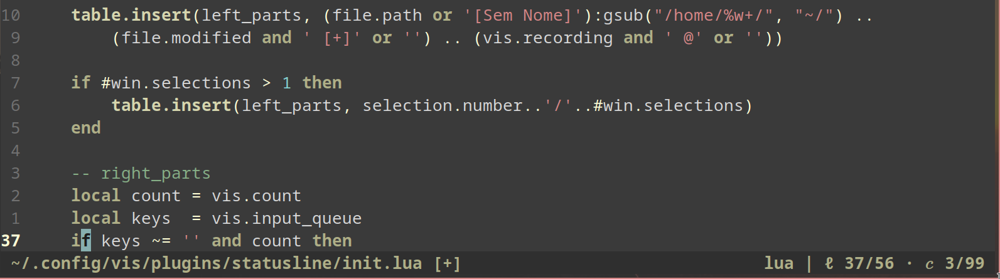

Simple statusline for the [vis-editor](https://github.com/martanne/vis).

```INSERT » ~/.config/vis/plugins/statusline/init.lua         lua | ℓ 2/53 · 𝑐 94/172```

```VISUAL » ~/.config/vis/plugins/statusline/init.lua    2i | lua | ℓ 2/53 · 𝑐 94/172```



